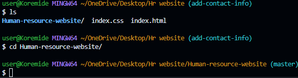
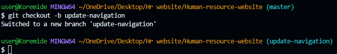
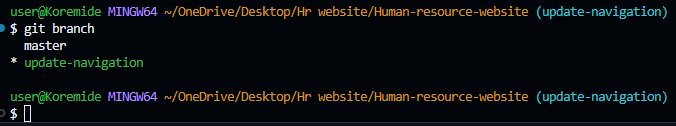
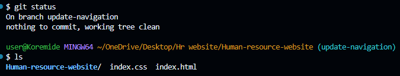
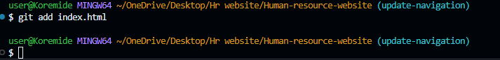
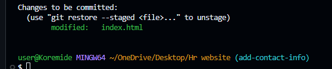

BASIC-GIT-COMMANDS

## MINI-PROJECT 3

##### This project involves two developers working together on a designated task. Their duties include cloning the central repository, creating a new branch, making modifications on that branch, merging those changes, pushing the updates to Github, and finally merging the branch into the main project.

- step 0

### Initial setup:

- step 1

### Created github repository for Hr website

- step 2

### git clone repository from the central repository to local machine

- step 3

### Navigating into the newly cloned repository

- step 4

### Navigating into the newly cloned repository

- step 5

### Checking index.html status using git status

- step 6

### Staging changes for index.html in Hr website

)

- step 7

### Confirming index.html for staging in Hr website

- step 8

### first commit for Hr website

- step 9

### Pushing the master origin to git hub

- step 10

### Tom navigates into the newly cloned directory

- step 11

### Tom checking the current branch using git branch

- step 11

### Tom new branch update-navigation

- step 12

### Verifying Tom's update-navigation branch

- step 13

### Tom adding content to update-navigation

- step 14

### Checking Tom's update-navigation status

- step 15

### Staging Tom changes

- step 16

### Tom changes being committed

- step 17

### Pushing Tom changes to online repository

- step 19

### Switching back to the Master Branch

- step 20

### Pulling the latest changes for jerry

- step 21

###

- step 22

### Changes to jerry's index.html staged

- step 23

### Committing Jerry's changes to repository

- step 24

### Pushing jerry's changes to central repository

